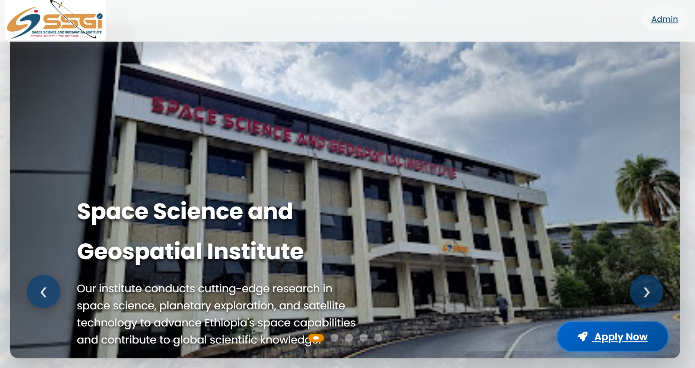

# Internship Management System

An Internship Management System built with **Django** and **PostgreSQL** to streamline the process of handling internship applications, department requirements, approvals, and student placements.

This project helps organizations manage internships by allowing students to apply online, departments to submit requirements, and admins to approve and monitor the overall process.

---

## Features

-  **Student Applications** – Students can apply for internship opportunities via an online form.
-  **Department Management** – Departments submit requirements, specify preferred fields and number of interns, and view assigned interns.
-  **Approval Workflow** – Admins review, approve, or reject applications and department requirements.
-  **Matching Algorithm** – Matches interns to departments based on skills, interests, and department needs.
-  **Dashboard** – Track approved interns, assigned departments, pending matches, and statistics.
-  **Database Integration** – All data is stored securely in PostgreSQL, including applications, department requirements, matches, and approvals.
-  **Export Support** – Generate reports (Excel/CSV) for approved internships and department assignments.
-  **Admin Panel** – Manage students, departments, matches, and approvals with custom actions and filters.

---

## Tech Stack

- **Backend:** Django (Python)
- **Frontend:** HTML, CSS, JavaScript (Vanilla + Bootstrap)
- **Database:** PostgreSQL
- **Other Tools:** Django Admin Panel, openpyxl (for Excel export)

---

## Installation

### 1. Clone the repository

```sh
git clone https://github.com/your-username/internship-management-system.git
cd internship-management-system
```

### 2. Set up the Python environment

```sh
python -m venv venv
venv\Scripts\activate      # Windows
# or
source venv/bin/activate   # Mac/Linux
```

### 3. Install dependencies

```sh
pip install -r requirements.txt
```

### 4. Configure PostgreSQL

- Create a PostgreSQL database named `intern`.
- Update `DATABASES` in `stellar_core/settings.py` with your PostgreSQL credentials (or use `.env` for secrets).

### 5. Run migrations

```sh
python manage.py makemigrations
python manage.py migrate
```

### 6. Create a superuser

```sh
python manage.py createsuperuser
```

### 7. Start the development server

```sh
python manage.py runserver
```

---

## Admin/Superuser Access Guide

This section explains how to create superusers for full admin access and how to restrict other admin users to only see specific tables in the Django admin dashboard.

### 1. Create a Superuser (Full Admin)
- In your terminal, run:
  ```sh
  python manage.py createsuperuser
  ```
- Enter a username, email, and password when prompted.
- This user will have full access to all tables and admin features.
- Log in at: http://127.0.0.1:8000/admin/

### 2. Create a Restricted Admin User
- Go to **Users** → **Add user** in the Django admin.
- Enter username, password, and save.
- On the user change page, check **Staff status** (so they can log in to admin), but leave **Superuser status** unchecked.
- Assign only the following permissions (in the user’s permissions tab):
  - Internship applications: Can view/add/change
  - Departments: Can view/add/change
  - Matches: Can view/add/change
  - Approved: Can view/add/change
  - Progress: Can view/add/change
- Do NOT assign permissions for other models.

### 3. Restrict Table Visibility
- In the user’s permissions, only select the above models.
- When this user logs in, they will only see and manage the tables you allowed.
- For more advanced restrictions, use Django’s [ModelAdmin permissions](https://docs.djangoproject.com/en/5.2/ref/contrib/admin/#modeladmin-permissions) or a custom admin class.


---

## Department User Access Guide

This guide explains how to create department users in Django admin and restrict their access so only users in the 'department' group can log in to the departments portal (`departments.html`).

### 1. Open Django Admin
Go to: http://127.0.0.1:8000/admin/
Log in with your superuser (admin) account.

### 2. Ensure the Group Exists
- In the left menu, click **Groups** → **Add Group**.
- Name: `department` (exact lowercase) → Save.

### 3. Create the User
- Left menu → **Users** → **Add user**.
- Enter Username (e.g., `dep_it`), Password, Confirm password → Save.

### 4. Assign Group
- After saving, you’ll see the user’s change page.
- **Groups** → move `department` to Selected groups → Save.
- Leave Staff status and Superuser status unchecked.

### 5. Open the Portal (if closed)
- Left menu → **Departments portal config**.
- Set it to OPEN or use action “Open for 7 days” → Save.

### 6. Test Login as Department User
- Visit: http://127.0.0.1:8000/accounts/login/
- Log in with the new user.
- You should be redirected to: http://127.0.0.1:8000/departments/

---
**Notes:**
- Access is granted by group membership only (`department`). No extra permissions needed.
- Admins can access everything; department users only see `/departments/`.

---


## Usage

- **Admin Panel:** Manage students, departments, department users matches, and approvals at  
  👉 http://127.0.0.1:8000/admin/
- **Students:** Apply for internships through the application form at `/apply/`.
- **Departments:** Submit requirements via the department portal at `/departments/`.
- **Approvals:** View and approve submitted applications and requirements in the admin panel.

---

## Project Structure

```
intern/
│── apps/
│   ├── accounts/         # User accounts and authentication
│   ├── adminpanel/       # Custom admin logic and dashboard
│   ├── applications/     # Handles student applications
│   ├── approved/         # Approved internships
│   ├── departments/      # Department requirements module
│   ├── matches/          # Matching interns to departments
│   ├── progress/         # Progress tracking and statistics
│── motivation_letters/   # Uploaded motivation letters
│── passport_ids/         # Uploaded passport IDs
│── recommendations/      # Uploaded recommendation letters
│── resumes/              # Uploaded resumes
│── templates/            # HTML templates (interns.html, departments.html, admin.html, etc.)
│── stellar_core/         # Core Django project files (settings, urls, wsgi)
│── manage.py
│── requirements.txt
│── .env                  # Environment variables for secrets
```

---

## Database Models

- **InternshipApplication:** Stores student application data.
- **Department:** Stores department requirements, preferred fields, and intern counts.
- **Match:** Stores intern-department matches and scores.
- **Approved:** Stores approved internships and registration status.
- **ProgressView:** Tracks progress and statistics.

---

## Contribution

Contributions are welcome! Please fork the repository and submit a pull request.

---

## License
This project is proprietary and intended for internal use by Space Science and Geospatial Institute. Unauthorized copying, distribution, or use is prohibited.

---

## Authors

Internship Management System Project Team  
Built as part of internship/project work at Space Science and Geospatial Institute.


## Pictures

### Home Page


### Home Page


### Home Page


### Student Application Form


### Student Application Form


### Department Requirements Submission


### Admin Dashboard

